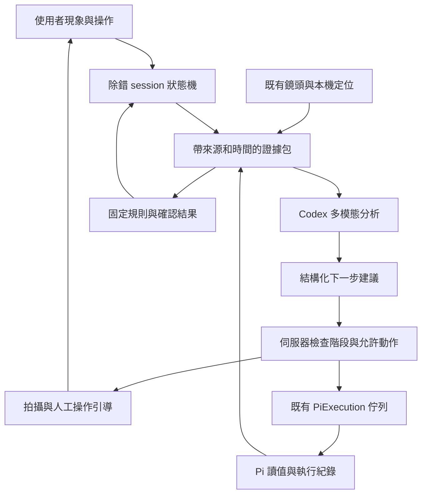

# AI 虛實整合除錯：第一版設計與驗證

日期：2026-09-25；2026-09-27 更新雲端入口與引導流程。狀態：第一版程式與隔離模擬流程已完成；下述現場指標尚未完成實體驗收。

## 本次實作紀錄

- 04 以「幫我檢查」作為單一主要入口，實際建立雲端看圖工作階段；唯讀紀錄檢查與固定測試收在可展開的手動工具。手動零件結果與重測放在同一卡片，檢查完成不自動捲動。雲端逐輪取得共用即時影像的新照片，不宣稱連續視訊串流理解。
- 雲端觀察包含新照片、現象、經遮蔽且有長度上限的 Pi／程式／版本／測試摘要。模型回傳可見事實、判斷原因與具體下一步，前端呈現實際模型回覆。未完成接線確認仍可開始看圖與取得引導；硬體測試、修復後試跑及整合試跑在提交工作時另行核對條件。
- 04 延續整段作品流程：雲端證據包含作品目的與參數、catalog 實際選用的電氣 variant、預期接線、逐腳人工確認、測試有效性，以及案件最初問題與後續回覆。選定 HC-SR04+ 的 3.3V profile 視為既知作品規格，不能因通用 HC-SR04 絲印而例行要求重新證明型號；有明確矛盾或更換零件時才釐清差異。人工回覆、接回 03 確認及補拍是不同的下一步，只有需要新視角才顯示補拍操作；同一句指示不再同時作為目前步驟、取景目標和觀察結尾重複呈現。
- 對話依時間呈現使用者、AI 與各輪照片，輸入框固定在對話下方，保留等待秒數與回覆耗時。預設快速模式沿用選定模型的較低支援推理強度，深入模式沿用原選擇。純文字追問只帶已有觀察及目前唯讀 Pi 狀態，不重新拍照或重跑完整環境檢查，也不能以歷史照片啟動硬體工作。六次模型呼叫上限包含文字對話。
- 每次成功的雲端觀察保存實際解析的模型、完成時間、耗時及送入照片的識別碼／雜湊；只有完成且可解析的回覆才有這份紀錄。測試失敗後重新讀取 Pi 證據、取得新照片，再請模型判斷；使用者依引導調整後，以「已調整，讓 AI 再看」開始下一輪觀察，等待期間不自動重複呼叫模型。
- 一般看圖保留原始照片作證，送入雲端的衍生影像等比例縮至長邊最多 1920 px，保存原圖及送入影像的雜湊與大小。TFT 測試階段的顏色／標記／測試碼辨識仍傳原始影像。
- 04 使用原有 `VideoView` 呈現 Webcam、鏡像後的取景框與本機畫質提示。取景迴圈以約 300ms 的影格選取窗口更新提示；實際 P95 仍須在目標設備量測。Eye 須先走原有恢復 Webcam 流程。拍照證據來自共用來源的原始影格，不含前端疊圖。
- `DebugSessions` 將現象、照片、Pi 工作、觀察與下一步綁定到作品、接線、程式、Pi 及相機版本；`DebugCases`、`ComponentTests`、`IntegrationTrials` 和 `PiExecution` 維持各自的診斷與執行職責。後端只接受固定動作，模型不能直接下 SSH 或代送人工通過。
- HC 由使用者分別確認近、遠目標已擺妥，再以 Pi 新回波判定；TFT 使用獨立的相機協作 runner，在 RGB 各色寫入後顯示 3 秒與私有標記，測試碼顯示 15 秒。相機觀察與選碼／顏色的人工最終確認分開保存。
- 支援單 Pi 活躍工作階段、重複動作去重、執行交接與停止核對。後端重啟後保留只讀摘要、暫停舊案件，使用者核對遠端工作並停止舊案後，需以目前草稿開新案；不從摘要重播動作。照片每案最多 24 張／64 MiB，結束或暫停 15 分鐘後從記憶體清除。軟體與隔離模擬瀏覽器流程已驗證，實際 Pi、Webcam、螢幕、Codex 往返及 P95 時間尚待現場驗收。

以下保留設計推導與驗收規則；若表格使用「建議」「需」字樣，代表設計意圖或仍待實機量測的項目。

### 2026-09-27 真實雲端看圖驗證

- 在實際 8100 頁面按「幫我檢查」，以 `no_echo` 現象建立案件 `025c9be0e6f2456d97136f650426a08c`。沿用 MX Brio 共用影像，送出 13:11:45 的新原始影格 456（3840 × 2160），未建立第二條相機串流。
- `gpt-6-luna` 成功回覆；bridge 記錄本次耗時 24,594 ms、照片識別碼與 SHA-256。模型指出 HC 接腳看似沒有接線，讀到既有 TFT 畫面的 `2613`，並引導先斷電檢查接頭。此文字來自實際雲端回覆。既有顯示碼不是本次新 TFT 測試的證據，沒有記錄實體通過。
- 瀏覽器顯示對應原始照片、觀察、原因及「已調整，讓 AI 再看」；分析前後右側捲動位置均為 122 px。案件停在等待使用者調整，雲端呼叫 1 次、硬體工作 0 次。另檢查 390 px 手機寬度無水平溢出。
- 本次驗證只確認真實相機到雲端回覆與介面流程；不是 HC／TFT 功能通過、完整現場樣本驗收、延遲 P95 或辨識準確率測量。

後續依「應沿用整段工作流程」回饋修正後，再以相同 HC 問題驗證案件 `44020c0a0cfb4fe0bca679dc55246818`：模型取得已選 HC-SR04+ 3.3V 規格與四條線的確認紀錄，回覆針對照片／紀錄差異的單一文字問題「拍攝這張照片時，HC-SR04 是否已接到 Pi？」。未要求重讀規格或轉去確認整組 TFT。實際雲端回覆 17,297 ms，1 次呼叫、0 硬體工作；介面為「等待你回覆」，沒有補拍按鈕、重複取景文字或鏡頭舊提示。42 項後端工作階段測試、21 項前端專項測試與建置通過；此為單次真實流程驗證，非辨識準確率測量。

### 2026-09-27 對話、取景框與速度驗證

- 案件 `10cbb70e4ea54aec9e742fa8f60036a1` 沿用瀏覽器當前選定的 `gpt-6-astra`，快速模式實際採用 `low`。第一輪看圖耗時 15,625 ms；原始 JPEG 915,000 bytes 保留，送入模型的 1920 px 衍生圖為 238,839 bytes，兩者各有 SHA-256。
- 以 Enter 送出「螢幕上的 2613 為什麼不能當作測距結果？」後，第二輪文字回覆耗時 7,828 ms；回覆明確引用先前照片與快取狀態。收據的圖片輸入為空，累計仍是 1 張照片、2 次模型呼叫、0 個硬體工作，四則使用者／AI 訊息都保留。
- 實際桌面中 HC 取景框寬約為來源影像的 84%；回覆期間右側頁面維持在 0 px，僅對話區捲動。輸入與送出操作可在桌面視窗內使用；手機尺寸檢查未見水平溢出。重新整理接回同一份對話，沒有重新拍照或呼叫模型。
- 後端工作階段及相機證據測試 65 項、前端除錯相關測試 48 項與 TypeScript／Vite 建置通過。此次是兩次真實模型往返的樣本，與先前模型、提示和環境不同，不能當作固定加速比例、P95 或硬體功能驗收。

## 1. 結論與第一版範圍

可在現有 Board Vision 上加入「AI 主動觀察、安排測試、引導補拍、根據實體結果繼續除錯」。現有鏡頭、Codex 看圖、Pi 零件測試與執行佇列都可沿用；主要新增工作是把它們串成有狀態、有證據的除錯流程。

第一版鎖定 Raspberry Pi 5、HC-SR04+、MRD-TFT240，使用目前接入 Board Vision 的 webcam。Eye 在 04 除錯的整合留到下一版；目前 Eye 相機來源與全螢幕導引模式相連，不能只把 04 的鏡頭區顯示出來。04 頁的「幫我檢查」入口形成以下體驗：

> 使用者說「螢幕沒有反應」→ AI 檢查環境與程式 → 請使用者將螢幕移入取景框 → 到位後自動拍攝 → 執行既有螢幕測試 → 拍到當次 RGB 與測試碼 → 比對 Pi 執行紀錄 → 回報已確認現象與下一步。

「自動」包含選下一項檢查、自動取證、執行本次允許的固定測試及必要重測、整理結果；移動物體、調整鏡頭和接線仍由人完成。程式修復由使用者看過差異後確認，TFT 的實體通過也保留人工最終確認。現有硬體沒有替人移動物體或改線的機構。

## 2. 現在已有什麼、缺少什麼

| 能力 | 目前程式 | 本提案需補上 |
|---|---|---|
| AI 看圖 | `CodexBridge.generate(image_paths=...)` 已送 `localImage`，檢查模型影像能力；04 已傳入新照片與關聯證據 | 持續量測真實場景辨識與雲端往返時間 |
| 鏡頭與定位 | 原始影像、板卡／零件定位、影像與姿態配對已存在 | 04 取景介面、針對除錯目標的畫面品質檢查 |
| 挑清楚的照片 | `capture_best_images` 在請求後 650ms 內評比最多 9 個候選 | 通用場景／TFT 擷取契約、持續取景引導、測試階段取證 |
| 接線照片建議 | CloudWiring 後端仍掛載；原有前端檢查元件目前未接入主流程 | 抽用擷取與看圖能力；新增通用除錯觀察資料，不套用單條線的舊請求格式 |
| 零件測試 | HC 近遠回波、TFT RGB 與四位碼、人工確認 | AI 選擇測試、引導準備、把影像綁定本次測試 |
| 程式診斷 | 唯讀檢查、受限邏輯修復、離線檢查、草稿還原 | 把視覺觀察納入同一案件的事實、假說與下一步 |
| 試跑與執行互斥 | 共用 FIFO、遠端鎖、60 秒試跑、停止與斷線恢復 | 除錯 session 的操作範圍、狀態恢復與動作去重 |
| 自主除錯流程 | 目前由使用者逐一操作 | 有上限的 Observe → Decide → Act → Verify 迴圈 |

以目前來源碼為準；早期文件曾寫 bridge 只有文字輸入，已不適用。舊 `cloud-wiring-check.md` 的 UI 與零件清單也含歷史內容，不能直接當成目前產品介面。

## 3. 建議的產品流程

1. **開始本次除錯**：選「沒有距離」「螢幕異常」「作品行為不對」，也可輸入現象。畫面說明本次會傳送選取照片給 AI、可執行哪些零件測試；目前作品若佔用硬體，沿用顯示實際執行對象的交接確認。
2. **結合畫面與可直接確認的原因**：檢查 Pi 連線、缺少套件、SPI／權限、語法、執行版本、已有測試，再將新照片與診斷證據交給模型。環境問題和接線尚未確認不應冒充雲端分析結果；可先取得看圖引導，提交硬體工作時才核對其執行條件。
3. **AI 決定缺哪份證據**：例如螢幕正面、HC 前方目標、Pi 排針全景或指定接頭側面。每次只提出一個可操作的要求，說明拍這張要確認什麼。
4. **本機引導取景**：畫面框出目標，顯示「再靠近」「避開反光」「保持不動」。品質達標後自動選圖；使用者也可手動拍照。定位不確定時先要求全景，不能把猜測的精準腳位框當成證據。
5. **執行並觀察**：伺服器核對本次允許的測試及接線狀態，再透過共用佇列啟動。AI 等待實際結果，不自行填入成功。
6. **結合結果選下一步**：環境正常但沒有回波，先調整目標並重測；螢幕有 RGB 但沒有數字，聚焦於顯示階段；軟體與實體證據矛盾時保留矛盾並補拍。
7. **完成或有理由地停止**：得到足夠證據後結束；連續補拍無改善、達到重測上限或狀態未知時，整理仍缺少什麼，提供人工處理入口。

桌面 04 頁可調整為「左側鏡頭／標記、右側當前指示與結果」，下方放距離變化與測試時間線。維持一個輸入框與一個主要下一步；原始日誌、照片來源和版本放在可展開區。手機版上下排列。停止本次流程的操作一直可見。

## 4. 三項核心能力的設計

### A. AI 觀看鏡頭

本機視覺持續處理畫面，負責定位、清晰度、曝光與穩定度；AI 收到的是事件觸發的一組新照片與文字證據。取景觸發時機為開始案件、取景完成、測試階段切換、異常或使用者要求看新畫面。單純文字追問沿用有時間標記的觀察與目前 Pi 狀態，不附上歷史照片冒充現場。

第一版每輪看圖從原始來源選一張新的全景；要求特定零件或接頭視角時，使用取景框引導使用者移動鏡頭或目標，保留原始全景作證。全景框為影像寬度 92%，零件／接頭框約 80–84%，沿用鏡像與縮放座標。TFT 測試則附四個有序階段的實拍影格。這是帶時間資訊的照片觀察，不宣稱現有 Codex bridge 已提供連續低延遲影片理解。雲端實際回應時間必須量測，不能從鏡頭 FPS 推論。

原始照片不帶前端預期接線、腳位圓點或 AI 合成內容。定位座標與不確定程度可另外提供。影像品質分數只用來挑圖，不能代表接線或辨識正確率。

### B. 自動測試與下一步選擇

AI 回傳結構化建議，由本機狀態機執行。沿用 bridge 的受限工具模式，第一版無須讓模型直接取得 SSH 或任意 Python 執行能力。

建議動作目錄：

| 動作 | 執行者與限制 |
|---|---|
| `read_diagnostics` | 讀取既有環境、版本、日誌與測試紀錄 |
| `request_capture` | 指定支援的目標、視角及想確認的現象；使用者移動鏡頭，本機判斷取景品質 |
| `run_component_test` | 只選 catalog 支援的既有固定測試；完整人工接線確認及環境檢查仍為前提 |
| `request_user_step` | 要求擺放／移動目標或回報現象；第一版以「準備好了」切換 HC 階段 |
| `run_trial` | 在本次明確允許的範圍內執行既有 60 秒試跑 |
| `propose_logic_fix` | 使用既有差異、離線測試、確認套用及還原流程 |
| `finish_or_escalate` | 完成摘要，或指出缺少的視角／量測／人工判斷 |

每項建議包含 `reason`、`evidence_ids`、`expected_observation`、`stop_condition`。伺服器驗證動作 enum、目標、參數、目前階段及操作授權，模型輸出不是直接可執行的命令。

「幫我檢查」建立限於本次作品／Pi／接線版本的 session。拍照、查詢與已允許的固定測試在 session 內連續進行；替換程式、修改設定／接線、安裝套件或啟動正式部署仍使用明確操作。現有執行佇列的 service 身分交接確認繼續生效，session 不可替陌生或已改變的執行對象代為確認。

建議初始上限：每案最多 6 次實際 Codex `turn/start` 呼叫，包含定位、逐端點分析及重試，不以高層 job 數計算；每個固定測試最多 2 次嘗試、同一補拍要求最多 2 次無改善重試。以上皆為待實測調整的產品參數。每次重測必須有新證據或已完成準備動作。等待使用者期間不持續呼叫 AI；超出時間或額度就保留案件並停止新增工作。

### C. 引導拍攝與主動取證

補拍要求使用固定資料結構，例如目標 `tft_screen`、角度 `front`、目的 `read_current_test_code`、限制 `screen_fully_visible`。UI 用模板呈現，AI 可補充簡短原因。

拍攝流程為：確認目標 → 提示距離／方向／反光 → 偵測穩定 → 自動選圖 → AI 判斷是否足夠。不能只顯示「看不清楚，重拍」；要指出哪個區域被擋住或哪個問題仍無法回答。

本機清晰度／曝光可以先沿用現有方法；遮擋比例、可讀性與手持穩定門檻須收集實拍資料校準。固定 webcam 無法看見接頭側面時，UI 必須要求使用者調整鏡頭／物體，或承認需要另一個視角。單張照片的數位裁切不能補回被遮住的接點。

## 5. 最有價值的兩個完整案例

### TFT：Pi 說送出了畫面，鏡頭是否真的看到？

1. 檢查套件／SPI／權限；引導螢幕進入鏡頭，取得可用的螢幕區域。
2. 啟動固定測試：依序 RGB，再顯示本次隨機測試碼。沿用既有碼的概念並綁定 `run_id`。
3. 本機擷取器在各顯示階段持續採樣，保留階段前後的少量影格。雲端分析在取證完成後執行，避免模型延遲錯過顏色與數字。
4. 觀察器只讀照片上的顏色與文字。**不提供正確測試碼、答案候選或會洩漏答案的日誌給觀察器**；預期碼由後端私有比對。
5. 影像模型只讀取照片中的顏色與文字，後端私下比對各階段標記和當次碼；品質不足則回傳無法判定。反光、旋轉或缺損由 AI 作為觀察描述，不當成固定測試通過。
6. 第一版顯示「鏡頭已讀到本次碼／仍需人工確認」，保留人工確認。自動記錄實體通過屬後續版本的獨立決策。

必補工程：目前 RGB 每色約 1 秒，只有一般輪詢可能漏掉；需依測試階段建立本機影格緩衝與擷取協定。跨 PC／Pi 的時鐘不能直接假設相同，要記錄階段序號、Pi 發送時間、PC 收到時間及同步誤差。需要時延長並參數化固定顯示期，建立新 runner 版本，遠端期限仍有效。

目前 runner 在寫入螢幕之前就更新階段名稱；新增協定須有寫入完成事件或可讀的階段標記，並把時鐘、傳輸及相機緩衝延遲納入取證時間窗。時間不確定範圍跨越階段切換的影格不得用來判定通過。最後讀到測試碼只支持該碼的顯示，不能補證前面的 RGB 三個階段；漏拍時補測或保留無法判定。

新增結果必須標記 `verification_source=camera_rule` 或 `human`；AI 絕不能透過既有 `visual` 動作冒充使用者確認。既有測試碼 API 隱藏答案的行為應保留。

### HC：AI 引導操作，Pi 提供新回波

1. 引導把平整目標放到 HC 前方，確認鏡頭能看見感測器與目標。
2. 使用者按「準備好了」，取近段新樣本；再要求將目標移遠並取遠段新樣本。
3. 沿用每段至少 5 個新有效回波、遠段中位數比近段至少增加 5cm 的既有規則。
4. 視覺可補充「目標似乎離開朝向」「手遮住目標」等待確認原因；不能把單目畫面估測當作真實公分距離。
5. 對無回波、讀取執行緒例外、權限問題分別處理。仍無法確認時，才引導拍攝接頭／腳位；建議重接線前沿用斷電步驟。

第二版才評估由影像判斷「目標已擺好」並自動切換階段；必須證明不會在手仍移動、目標錯位或畫面外時提前取樣。若要驗證絕對距離精度，另需量尺、已知尺度或距離基準。

## 6. 架構與證據契約

新增 `DebugSession` 協調既有服務；`DebugCases` 繼續負責程式／環境診斷，`ComponentTests` 與 `IntegrationTrials` 保持硬體工作的執行者。

建議每份 `EvidenceBundle` 保存：

- 身分：`session_id`、`case_id`、`run_id`、Pi 目標、作品／接線／程式／模板版本。
- 影像：`capture_id`、鏡頭來源、frame ID、原始影格時間、擷取階段、裁切範圍、品質結果、圖片雜湊；合成來源明確排除於實體通過證據之外。
- 裝置：樣本序號、有效距離時間、顯示階段／序號、程序退出碼、日誌範圍。
- 判斷：可見事實、裝置事實、假說、支持／反對證據、缺少的證據與下一步；不用模型自報百分比當作校準過的正確率。
- 來源：人工確認與自動規則判定各自留存；舊照片、其他測試或過期草稿只能當歷史參考。

每一步採不可變證據快照與 idempotency key。拍攝後若換鏡頭、作品、Pi、程式或已確認接線版本，舊建議不得直接執行；使用者實際改線也要重新確認並更新版本。畫面上物體移動本身不等於已確認改線。

工作階段狀態：診斷、取景／等待使用者、測試、目視確認、修復／試跑、完成或暫停。重整只恢復查詢；後端重啟保留只讀摘要，舊工作須核對及停止後開新案，不重播動作或 AI 請求。

「停止本次流程」撤銷未開始工作、取消／忽略未完成 AI 建議；正在使用硬體的本次工作走既有停止與核對流程。未證實停止前保留鎖，不把前端已關閉視為 Pi 已停止。

初版使用每案最多 24 張／64 MiB 的短期記憶體照片快取，結束或暫停 15 分鐘後清除；案件摘要與影像雜湊保存於本機 runs。照片不得進 Git。傳送鏡頭照片時顯示狀態；第一版保留原始全景，不用不確定的定位結果產生局部裁切。程式與日誌沿用敏感資訊遮蔽。完整除錯包匯出留待後續。

## 7. 可行性與交付順序

| 項目 | 可行性／難度判斷 | 建議順序 |
|---|---|---|
| AI 看最新照片＋Pi 紀錄，給下一步 | 高可行；中等工作量，已有 bridge、擷取與診斷 | P1 |
| 指定區域補拍、穩定後自動選圖 | 高可行；中等工作量，品質門檻需現場校準 | P1 |
| 自動選擇並執行固定測試 | 高可行；中高工作量，核心是狀態／權限／互斥 | P2 |
| TFT 鏡頭驗證 RGB 與當次碼 | 可行；中高工作量，反光、文字、時序需實拍驗證 | P2，先輔助人工 |
| HC 視覺引導＋讀值交叉確認 | 可行；先人工準備切換，後評估自動切換 | P2 |
| HC 距離與 TFT 顯示內容同步驗證 | 可行；較高工作量，需要顯示內容與樣本的對應序號 | P3 |
| 從任意角度判斷每條接線與電氣安全 | 不能作第一版承諾；遮擋、接觸、導通和電壓缺少直接證據 | 維持輔助觀察／另設量測 |
| 連續語音與影片陪同除錯 | 可作後續獨立評估；目前 bridge 的照片介面不能直接視為完成 | P3 之後 |

P1 先交付可操作的鏡頭除錯助手：按下開始、取景、自動拍照、綜合分析、具體補拍、保留證據。P2 加入固定測試的自主安排與取證，TFT／HC 各做一個完整閉環，再串上現有的 60 秒整體試跑與確認式程式修復；P1 與 P2 合起來才是第一版。P3 才拓展精確的跨零件畫面同步、自動實體通過、Eye 與更多模組。

估工需在 P1 做完一次真實相機到 Codex 的延遲／配額量測後細化。主要不確定量在光照與視角資料、跨裝置時序，以及帳號模型回應；單純接 API 不是全部工作量。

## 8. 驗收方式與停止條件

以下是提議的驗收方式，沒有宣稱已達標。測試紀錄需包含相機、光照、視角、模組版本及程式版本。

第一版現場驗收固定採用：TFT 至少 20 組正常與 20 組異常場景，涵蓋反光、模糊、旋轉、遮擋、舊碼、黑屏與白屏；HC 至少 10 組正常與 10 組異常場景，涵蓋近遠移動、目標偏離、無回波及讀值停滯。正常可讀 TFT 場景至少 90% 應在兩次取景內讀對當次碼，且每一案仍由人完成最終實體確認。須記錄「描述異常 → 引導拍攝 → 自動測試 → 結果說明 → 下一步」實機流程的完成率、耗時、補拍與重測次數。本機取景提示的 P95 目標為 500ms 以內，AI 往返時間另行量測。

1. **端到端任務**：從「沒有畫面」完成定位、取證、TFT 測試、照片／讀值比對及可理解的下一步；HC 同樣完成近遠引導與結果解釋。測量任務完成率、耗時、補拍次數和不必要的重測次數。
2. **視覺資料集**：先收正常、黑屏、白屏、舊碼、字被遮住、反光、模糊、旋轉、錯模組、螢幕外等有真值案例；HC 包含新回波、舊值停滯、目標偏離、無回波與讀取例外。錯線素材在斷電時拍攝或離線回放，不為測試判斷率通電製造錯線。
3. **後續版本的自動通過門檻**：第一版 TFT 保留人工最終確認。將來若要讓相機取代人工判定，須另行達到預先約定的錯誤通過率及可判定比例。可用 300 個獨立、代表性的負例零誤通過作為「錯誤率低於約 1%」的初步單側 95% 統計門檻；重複相似影格不能充當 300 個獨立案例，也不代表所有新場景都安全。
4. **避免全部回 uncertain**：同時公布正常案例的可判定率、正確通過率與人工接管率。先以第一批資料建立 baseline，再約定發布門檻；不能只用整體 accuracy 隱藏少數高風險錯誤。
5. **證據綁定**：舊照片、合成畫面、錯 run／錯 Pi／錯接線版本、過期雲端結果與已改變的 service 都必須在確定性測試中被拒絕，不得更新本次通過紀錄。
6. **執行可靠性**：重複點擊、多分頁、AI 忙碌／逾時、SSH 斷線、瀏覽器關閉、後端重啟、使用者取消時不產生第二份硬體工作；固定 runner 遠端期限與保留控制按既有規則驗證。
7. **速度與資源**：本機取景回饋的設計目標為 P95 不高於 500ms；實測同時開啟目前辨識模型時的 FPS、CPU／GPU、影格記憶體、AI 往返 P50／P95、每案照片與呼叫量。未量測前不承諾雲端即時反應。
8. **因果邊界**：畫面黑不等於螢幕損壞、無回波不等於某腳接錯、程序正常退出不等於實體通過。報告必須指向真正支持該結論的證據；無法確認時提出有用的下一份證據。

## 9. 程式整合位置與參考

- [CodexBridge](../backend/app/codex_bridge.py)：沿用 `generate` 的圖片輸入、模型驗證、互斥與受限工具模式。共用 bridge 忙碌時顯示等待／逾時，不阻塞 Pi 期限或取景控制。
- [影像品質選取](../backend/app/wiring_capture.py)、[CloudWiringService](../backend/app/cloud_wiring.py)：抽出通用擷取部分；現有 request 以一條指定接線為單位，不適合作為整個除錯 session。
- [DebugCases](../backend/app/debugging.py)、[DebugPage](../frontend/src/components/DebugPage.tsx)：加入 session 入口、證據引用與主動下一步；程式修復繼續使用現有契約。
- [PiExecution](../backend/app/pi_execution.py)、[ComponentTests](../backend/app/component_testing.py)、[IntegrationTrials](../backend/app/integration_trials.py)：重用執行、交接、停止與核對，擴充 camera 規則的獨立來源與版本化 runner。
- [測試 runner](../backend/app/runtime/component_test.py)：現有 RGB 短階段及 15 秒測試碼需與本機取證協調；實體近遠判定沿用既有新樣本規則。
- [目前 04 設計與驗收](test-debug-stage.md)、[零件功能測試](component-functional-tests.md)、[照片品質契約](wiring-capture-quality.md)：區分軟體回歸與實體驗收。

官方 [Codex App Server 文件](https://learn.chatgpt.com/docs/app-server)確認 `turn/start` 支援文字、image／localImage，`model/list` 提供輸入能力。第一版可沿用現有登入與 bridge；這不代表 bridge 已有連續影片或任意鏡頭存取能力。

官方 [Images and vision 限制](https://developers.openai.com/api/docs/guides/images-vision#limitations)指出小字、旋轉及精確空間定位可能出錯。據此，本提案將看圖結果作為具來源的觀察，以受測規則及實體資料決定功能結果，並對密集腳位保留無法確認狀態。
