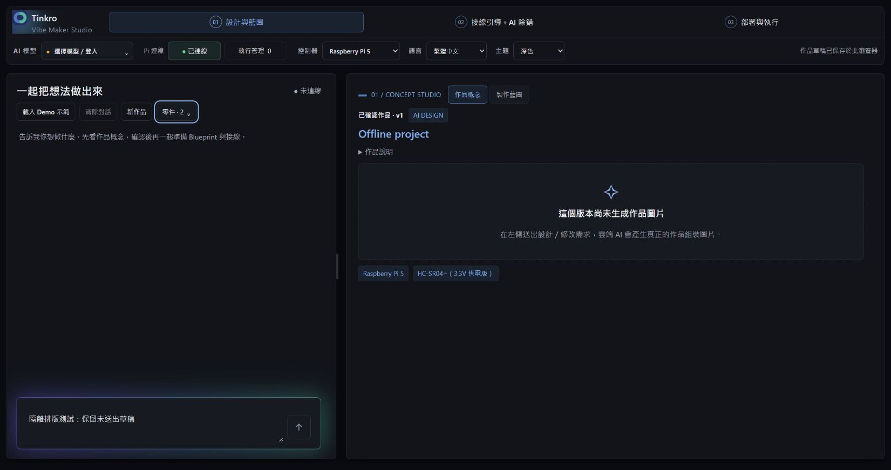
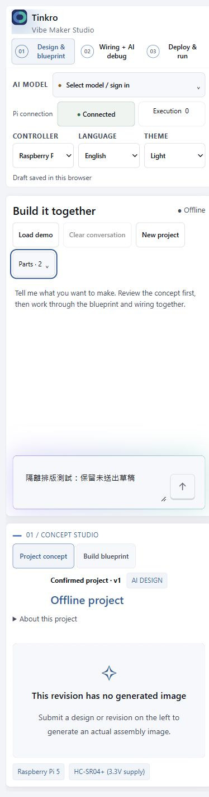

# Compact design conversation header

Verified 2026-10-01. Presentation-only change in MakerAssistant and maker.css.

- One heading/status row plus one wrapping tools row; Demo, Clear conversation,
  New project and Parts remain directly accessible.
- Removed the decorative CLOUD / CO-DESIGNER line. Stage/context and Demo
  explanations remain as tooltips and accessible descriptions, not visible rows.
- Existing confirmation, busy, parts, composer, error and generation behavior is
  unchanged. No request, storage, project version or Pi code was modified.

## Measurements

Actual production App, 1651 × 871, Chinese/dark, same isolated project and panel:

| Region | Before | After |
| --- | ---: | ---: |
| Panel top to conversation | 175 px | 96 px |
| Conversation height | 417.67 px | 496.67 px |
| Total panel height | 715.33 px | 715.33 px |

Recovered 79 px (~18.9% more conversation height). The Parts popover leaves the
conversation height unchanged.

## Verification

- `npm test`: 462 passed, zero failures; i18n parity and production build passed.
- Added a compact-header test for retained actions, accessible descriptions,
  removed normal-flow explanation rows and compact CSS geometry.
- Used `maker-stage-preview.mjs`, serving the production build on a separate
  loopback origin with synthetic data and no live backend/hardware access.
- Checked New project confirmation/cancel, Parts open/Escape dismissal, draft
  preservation across language/theme changes, English/light mobile 390 × 844.
- Mobile document width 375px (390px viewport including scrollbar); Parts popup
  bounds 22.67–352px. No horizontal overflow. Browser warning/error log empty.
- No real AI request, Pi action, production-tab reload, Git commit or push.
- Backend tests were not rerun for this isolated frontend layout change.

Screenshots are offline fixtures, not the user's project or live connection state:

