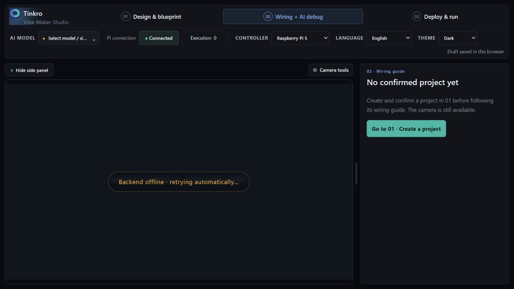
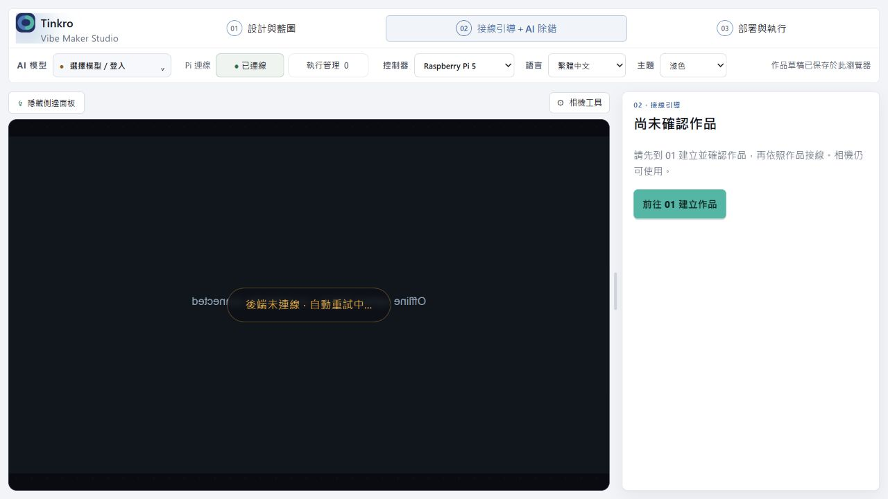
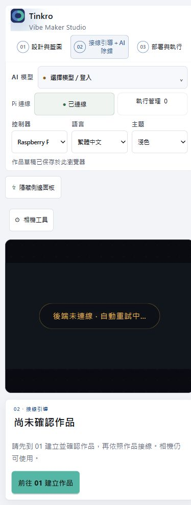

# New project → 02 stage isolation

Verified 2026-10-01. Frontend-only fix; no backend or Pi changes.

## Cause and behavior

After `newMakerProject` cleared the approved design, App treated stage 02 as the
legacy board workspace. Its right sidebar rendered an unbound `PiDeployPanel`,
showing standalone code and shared Pi history beside the camera.

- Empty Maker stage 02 now uses the full-width workspace and an empty guide with
  a return-to-01 action. Camera and camera tools remain in the same component tree.
- No legacy wiring card, deployment panel or AI workspace is rendered for this
  empty state. Debug-session loading is disabled without an approved design.
- Deployment is rendered only in stage 03. Existing confirmed-project guide and
  AI tabs, standalone/non-Maker board guides and HUD paths remain available.
- No reset, backup, API payload or Pi execution behavior was changed.

## Automated verification

`cd frontend; npm test`: **461 passed, 0 failed**, including 6 new stage tests;
i18n parity passed (757 keys); TypeScript and Vite production build passed.
Vite reports the existing >500 kB bundle-size advisory, not a build failure.

`tools/maker_stage.test.mjs` executes the actual App component and navigation
handlers with inert child components/external hooks. It covers English/Chinese
New project → 02 → return to 01, empty restored state, unconfirmed preview,
03-only deployment, confirmed guide/AI bindings, standalone/controller/HUD paths.
These tests do not claim to exercise hardware or child-component effects.

## Browser verification

Started `node tools/maker-stage-preview.mjs` on 127.0.0.1:18776, a separate origin
serving the **production build** with synthetic project/API responses. All fetch
calls are answered in memory or rejected; WebSocket is inert; CSP blocks network
connections. The fixture never proxies requests to the user's backend or Pi.

- Clicked actual New project and Confirm start over controls, then stage 02.
- Confirmed empty guide and return action; zero deployment and legacy guide cards.
- Navigated 02 → 03 → 02: exactly one deployment panel in 03 and none in 02.
- Return-to-01 action works on desktop and at 390 × 844.
- Checked English/dark and Chinese/light; no horizontal overflow at 390px.
- Browser warning/error logs were empty.
- Saved screenshots below. The disconnected camera overlay is intentional in
  this isolated fixture, not a statement about the user's live camera/backend.

Production localhost:8100 HTML was read without reloading the user's tab; it
references the new build (`index-DV3Rax_j.js`, `index-CCLqM2cO.css`). The user can
refresh to load the fix; no backend restart is required for these frontend assets.

No real AI submission, camera configuration, hardware test, Pi deployment, or
Git commit/push was performed. Backend regression was not rerun for this UI-only fix.
